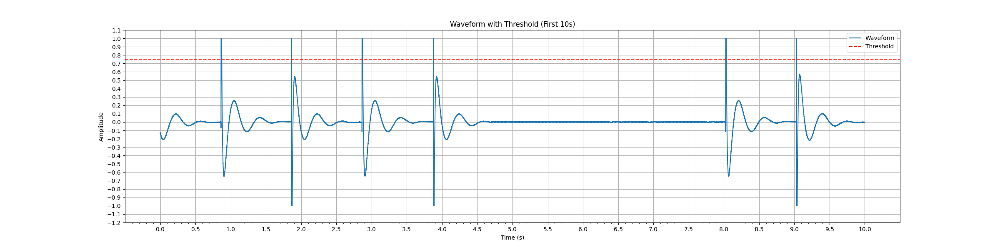
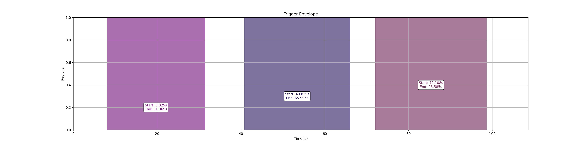

# WAV 边沿检测与包络可视化工具

Author: 沈逸潇 fusedbuzzer@gmail.com

Date: 2025/01/05


该程序用于处理大型 WAV 音频文件，检测上升沿（rising edge），并生成一个包含触发时间戳的输出文件。程序通过设置一个阈值来识别上升沿，阈值为最大振幅的 3/4（可调整）。支持将波形图和触发标包络图进行可视化，并输出触发标时间戳到文件。

## 功能

1. **处理大型 WAV 文件**：逐块读取文件并检测上升沿。

2. **波形与阈值可视化**：绘制前 10 秒的波形和阈值线，以供人工检查阈值是否合理。


3. **触发标包络图**：检测到的触发器被分为若干个区域，绘制每个区域的起始和结束时间，并支持设置最小区域时长和最大触发器间隔。


4. **触发标时间保存**：将检测到的触发时间保存到指定文件。

## 安装依赖

请确保已经安装了以下 Python 库：

```bash
pip install numpy soundfile tqdm matplotlib adjustText
```

## 使用方法

### 命令行参数

```bash
usage: script.py [-h] [--input INPUT] [--output OUTPUT] [--block_size BLOCK_SIZE]
                 [--thr THR] [--min_region_duration MIN_REGION_DURATION]
                 [--max_trigger_interval MAX_TRIGGER_INTERVAL]
```

| 参数                        | 说明                                       | 默认值                       |
|---------------------------|------------------------------------------|---------------------------|
| `--input`                  | 输入的 WAV 文件路径                          | `res/test-16bit.wav`        |
| `--output`                 | 输出触发时间戳的文件路径                        | `out/trigger_times.txt`     |
| `--block_size`             | 每块读取的帧数，防止内存溢出                              | `1024`                     |
| `--thr`                    | 阈值设置为最大振幅的百分比                    | `3/4`                      |
| `--min_region_duration`    | 每个区域的最小持续时间（单位：秒）               | `20`                       |
| `--max_trigger_interval`   | 相邻两个触发器之间的最大持续时间（单位：秒）。若超出该时间，则视为两个区域     | `3`                         |

### 示例

```bash
python script.py --input res/test-16bit.wav --output out/trigger_times.txt --block_size 2048 --thr 0.75 --min_region_duration 10 --max_trigger_interval 2
```

该命令会读取 `res/test-16bit.wav` 文件，检测触发器并将时间戳保存到 `out/trigger_times.txt`，每块读取 2048 帧，阈值为最大振幅的 75%。

## 输出

1. **触发时间戳文件**：生成一个包含所有触发时间戳的文本文件。每行表示一个触发时间（单位：秒）。
2. **波形图**：程序会绘制音频文件的波形图，并显示阈值线，目的是人工检验阈值是否设置合理。文件保存在 `out/waveform-first10s.png`。
3. **触发器包络图**：绘制触发器包络图，标出触发器所在的区域并显示每个区域的起始和结束时间。文件保存在 `out/trigger_envelope.pdf`。

## 代码结构

- `process_large_wav(file_path, block_size, threshold_percent)`：处理 WAV 文件，检测上升沿并返回触发时间戳。
- `save_trigger_times(trigger_times, output_file)`：保存触发时间戳到文件。
- `plot_waveform_with_threshold(waveform, frame_rate, threshold_percent)`：绘制波形图并显示阈值线。
- `plot_trigger_envelope(trigger_times, min_region_duration, max_trigger_interval)`：绘制触发器包络图。
- `main()`：程序入口，解析命令行参数，调用上述函数进行处理。
